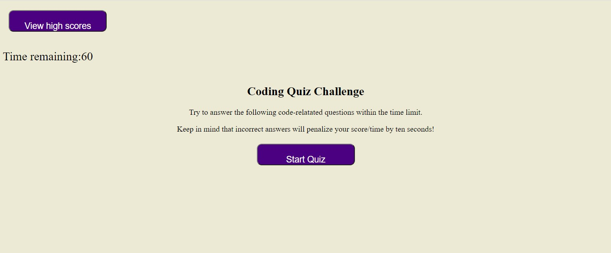
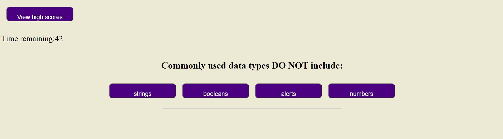

# coding-quiz
 
 ## Purpose
The purpose of this project was to create a timed quiz for users to review Javascript fundamentals and gauge their progress. 

## Description
Users are presented with a start screen that describes the timed quiz and the penalty for wrong answers. The quiz starts when the user clicks the "Start Quiz" button. Then the user is presented with multiple choice questions. When the quiz is complete (or the time runs out), the user given their score and the opportunity to enter their initials to save their score. Users can click the "View High Scores" button to view previous scores.

## Screenshots

## Credits
* https://www.w3schools.com/js/js_object_display.asp
* https://www.w3schools.com/jsref/met_node_appendchild.asp
* https://www.w3schools.com/jsref/met_loc_reload.asp

## License
MIT License

Copyright (c) [2021] [Alex Christianson]

Permission is hereby granted, free of charge, to any person obtaining a copy
of this software and associated documentation files (the "Software"), to deal
in the Software without restriction, including without limitation the rights
to use, copy, modify, merge, publish, distribute, sublicense, and/or sell
copies of the Software, and to permit persons to whom the Software is
furnished to do so, subject to the following conditions:

The above copyright notice and this permission notice shall be included in all
copies or substantial portions of the Software.

THE SOFTWARE IS PROVIDED "AS IS", WITHOUT WARRANTY OF ANY KIND, EXPRESS OR
IMPLIED, INCLUDING BUT NOT LIMITED TO THE WARRANTIES OF MERCHANTABILITY,
FITNESS FOR A PARTICULAR PURPOSE AND NONINFRINGEMENT. IN NO EVENT SHALL THE
AUTHORS OR COPYRIGHT HOLDERS BE LIABLE FOR ANY CLAIM, DAMAGES OR OTHER
LIABILITY, WHETHER IN AN ACTION OF CONTRACT, TORT OR OTHERWISE, ARISING FROM,
OUT OF OR IN CONNECTION WITH THE SOFTWARE OR THE USE OR OTHER DEALINGS IN THE
SOFTWARE.

### Deployed website
https://alexchristianson.github.io/coding-quiz/
